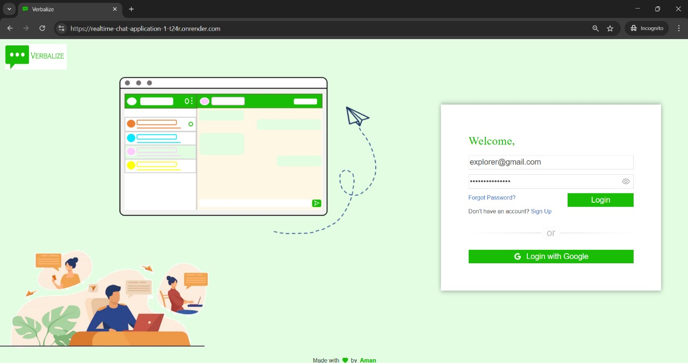
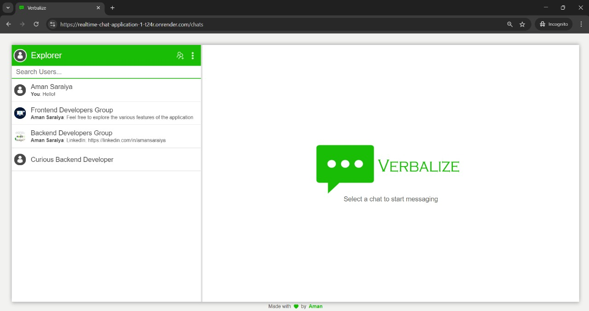
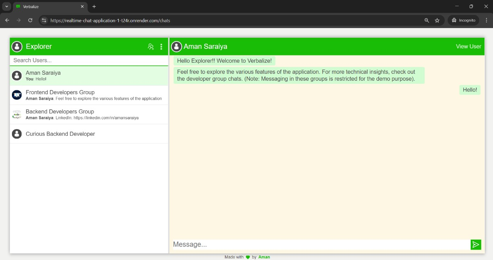
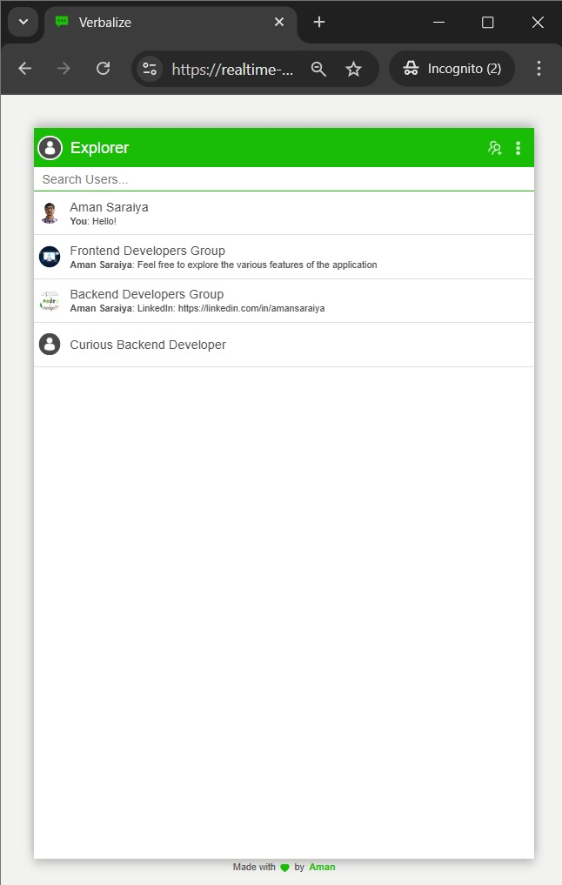
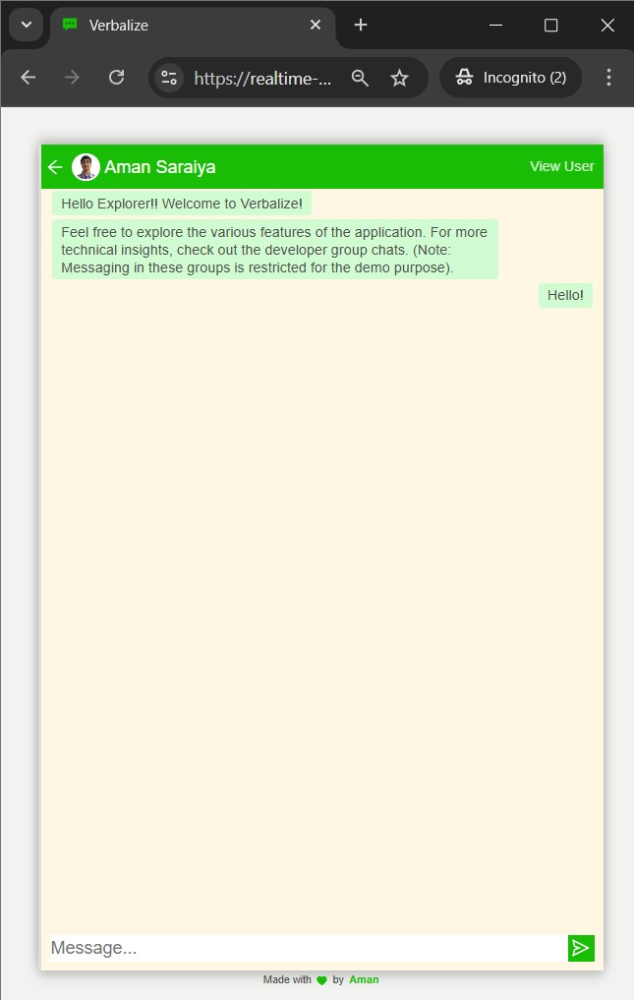
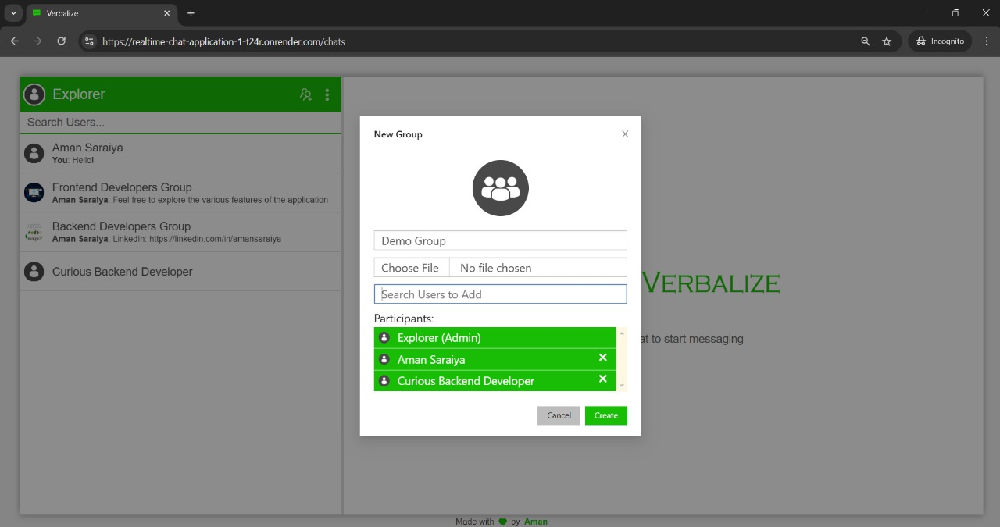
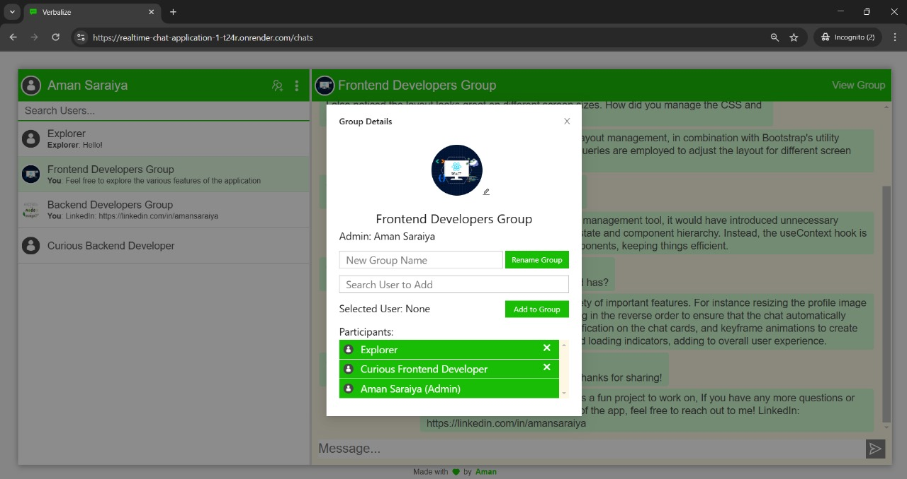
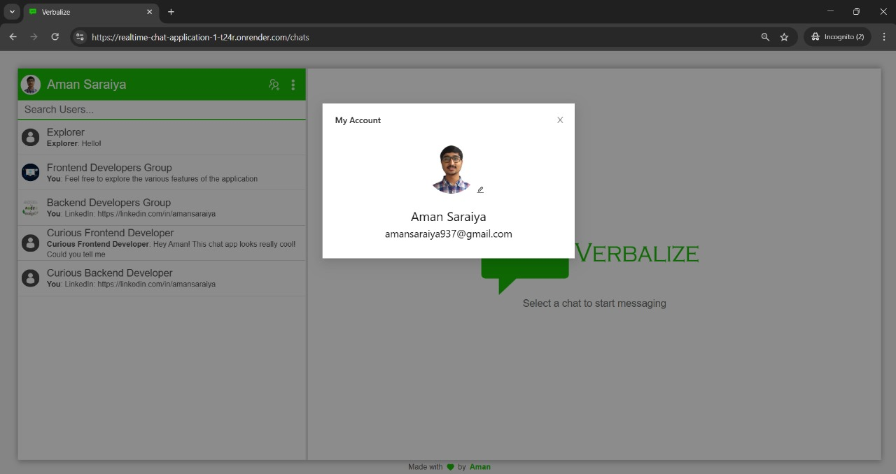
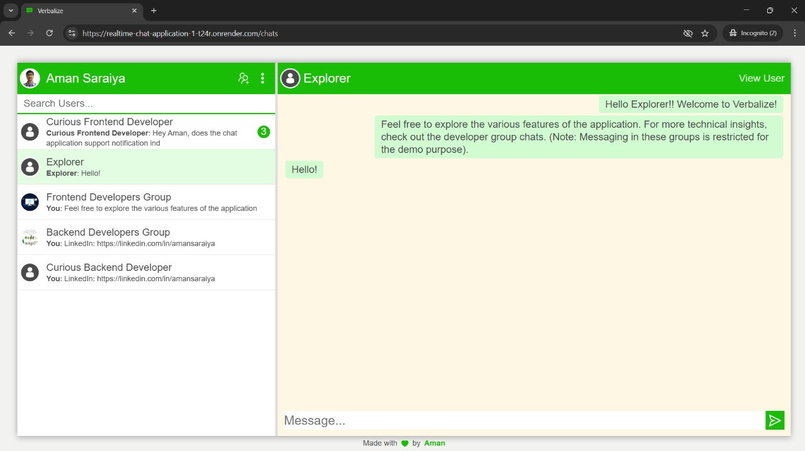

# Verbalize - Real-time MERN Chat Application

Welcome to the Real-time MERN Chat Application! This is a fully-featured chat platform built using the MERN stack (MongoDB, Express.js, React.js, Node.js) with WebSocket-based real-time communication. The application includes user authentication, image storage, and more.

## Features

- <b>Real-time Chat:</b> Messages are sent and received instantly using WebSockets.
- <b>Private and Group Chats:</b> Supports both private conversations (one-on-one) and group chats, allowing users to interact in real-time in both settings.
- <b>User Authentication:</b> Secure login and registration via email/password or Google sign-in via Firebase Authentication.
- <b>Profile Picture Upload</b>: Users can upload and resize their profile pictures.
- <b>Responsive Design:</b> Optimized for different screen sizes.
- <b>Typing Indicators:</b> Shows when another user is typing a message.
- <b>Chat Notifications:</b> Notification indicators for unread messages.

## Try It!

App Link: https://realtime-chat-application-1-t24r.onrender.com/

You may either register your own account or login with the following credentials.

> <b>Email:</b> explorer@gmail.com

> <b>Password:</b> explorewithaman

## Screenshots

### Login Page

### Chat Interface

### Realtime Messaging and Typing Indicator

[Demo](https://raw.githubusercontent.com/aman-saraiya/realtime-chat-application/refs/heads/master/screenshots/realtime_messaging_and_typing_indicator.mp4)

### Collapsed View on Smaller Screen (Responsiveness)

### Create Group, Group Details and Account Details Modals

### Notificiation Indicator

## Technologies Used

### Backend:

- Node.js with Express.js for the server
- Firebase for authentication
- MongoDB for data persistence
- Socket.io for real-time messaging (WebSockets)
- Cloudinary for image storage

### Frontend

- React.js for building dynamic user interfaces
- Firebase Authentication for secure user login and registration (supports email/password and Google sign-in)
- CSS Flexbox for layout management with Bootstrap and custom CSS
- Responsive Design: Media queries to support various screen sizes
- Keyframe animations for interactive elements (typing, loading indicators)

## Setup and Installation

<b>Clone the repository:</b>

    git clone https://github.com/aman-saraiya/realtime-chat-application.git

<b>Install backend dependencies:</b>

    cd server
    npm install

<b>Install frontend dependencies:</b>

    cd client
    npm install

<b>Setup environment variables:</b>

- Create a .env file in the root of both server and client directories.

- Add your MongoDB URI, Firebase credentials, and Cloudinary API keys.

<b>Start the server:</b>

In the server directory:

    cd server
    npm start

In the client directory:

    cd client
    npm start

Now, the application should be running on http://localhost:3000
